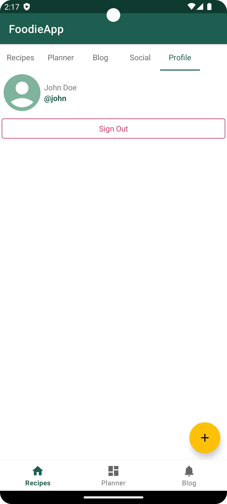

### Features

Key Features
1. User Authen1ca1on with Shared Preferences:
   • Design a secure authen1ca1on system to enter the app.
   • Implement user authen1ca1on with proper valida1on and securely store login
   creden1als using SharedPreferences.
2. Tab Layout with five Fragments: Recipes, Meal Planner, Blog, Contact, About Me:
   • Implement a Tab Layout with six tabs, each corresponding to a Fragment focusing on
   different aspects of the culinary experience.
3. Recipes Fragment with Dynamic RecyclerView:
   • Display a dynamic list of recipes using RecyclerView.
   • Include images, cooking 1me, and user ra1ngs for each recipe.
   • Implement a Floa1ngAc1onBuNon in this tab to allow users to dynamically add new
   recipes.
4. Meal Planner Fragment:
   • Provide a meal planning feature with the ability to schedule meals for specific days.
   • Include a calendar or recycler view for users to visualize and plan their weekly meals.
5. Blog Fragment with Dynamic Content:
   • Create a dynamic blog sec1on with regularly updated content.
   • Use a Floa1ngAc1onBuNon to let users contribute new blog posts.
6. Contact Fragment
   • Allow users seamless ways to reach out, ask ques1ons, or simply engage with the
   culinary maestro.
   i. Phone Connec1on
   Dial the chef directly with a single tap on the provided phone number, fostering immediate and direct communica1on.
   ii. Email Communica1on
   For more detailed inquiries or to share your thoughts, the
   ContactFragment features a direct email link. One-click, and you can compose an email to the chef, providing a convenient channel for extended conversa1ons.
7. About Me Fragment:
   • Include details about the app creator's culinary journey, favorite recipes, and food
   philosophy.
   • Add a Floa1ngAc1onBuNon to add new details dynamically.
8. BoNom Naviga1on for Quick Access:
   • Implement a BoNom Naviga1on bar for quick naviga1on between the main sec1ons
   of the app.

### Screenshots

